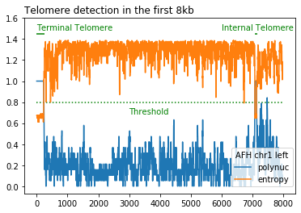
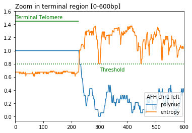

:Python version: Python 3.6, 3.7.3; most modules are Python2.7 compatible.

Telofinder
###########################

A python package to determine the location and the size of telomeric repeats (both terminal and internal) from genome assemblies. This version of the program only works for yeast genomes (telomere sequence TG\ :sub:`1-3`\)

Telomere detection is based on calculation in a 20 bp sliding window of the following two metrics:
    - DNA sequence entropy < entropy_threshold (default=0.8)

    - proportion of polynucleotides (default_list = ["CC", "CA", "AC"]) >  polynuc_threshold (default=0.8)

.. image:: build/zoom_int.png

Installation
###########################

install (mini)conda:

    see https://docs.conda.io/projects/conda/en/latest/user-guide/install/

add channels:

.. code-block:: bash

    $ conda config --add channels conda-forge bioconda

install the telofinder package:

.. code-block:: bash

    $ git clone https://github.com/GillesFischerSorbonne/telofinder.git
    $ cd telofinder
    $ conda env
    $ python setupy.py install

Usage
###########################
    
.. code-block:: bash

    $ conda activate telofinder
    $ cd telofinder
    $ python telofinder.py [fasta_path] 

Positional arguments
====================

  fasta_path
    path to a single (multi)fasta file or to a directory containing multiple fasta files

Optional arguments
==================

  -f, --force
    automatically replace the output 'telofinder_results' directory if present

  -e, --entropy_threshold
    entropy threshold for telomere prediction,
    default = 0.8

  -n, --polynuc_threshold
    poly-nucleotide threshold for telomere prediction,
    default = 0.8

  -s, --nb_scanned_nt
    total number of nucleotides scanned for telomere detection, starting from each chromosome extremity. If set to -1, the whole chromosome sequences will be scanned, default = 20 000 bp

  -t, --threads
    number of threads to use, default = 1

  -r, --raw
    outputs the raw dataframe (raw_df.csv) containing the values of all sliding windows

Help
=====

.. code-block:: bash

    $ python telofinder.py --help

Output
======

Telofinder outputs a directory called ``telofinder_results`` including 2 csv and 2 bed files containing the telomere calls and their coordinates, either as raw output or after merging consecutive calls

Reference
###########################

.. automodule:: telofinder.telofinder
    :members:
    :undoc-members:

Indices and tables
###########################

* :ref:`genindex`
* :ref:`modindex`
* :ref:`search`

